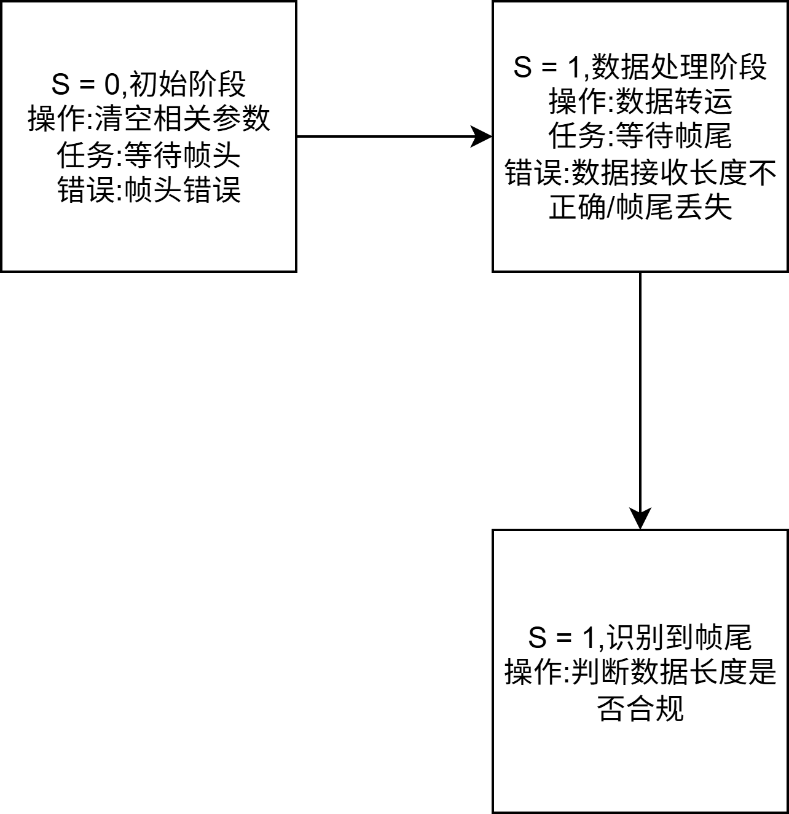

# 数据包单字符收发

## 1. 协议:

帧头(0xFF) , 有效数据个数 , 数据(高位 + 低位) , 帧尾(0xFE)

注:有效数据个数只含数据(含高低位)

## 2. 处理逻辑

### 2-1 error处理

* 帧头识别错误
* 数据接收理论长度与实际长度不合
* 帧尾格式错误,导致数据溢出

### 2-2 状态机逻辑

	1.HEX模式(长度可变):	
		我自己写的,经过尝试可以避开大部分问题
		
		*协议*
		帧头(0xFF) 数据个数 数据(高低位) 帧尾(0xFE)
		注:关于数据个数:可变,指的是数据包中除了帧头尾 + 自己的数据个数,由于是高低位,所以肯定是偶数,如果数据个数与数据实际个数不同就会报错
		
		*查询错误机制*
		error_Serial :
		1 : 帧头识别错误  2 : 数据接收长度不正确  3 : 数据帧尾格式错误,导致长度异常
		调用方法:Serial_GetError()
		
		*存在的问题*
		数据缺少帧头时,数据内部如果还有帧头0xFF,则error查不出来
		
		*关于数据处理*
		可以更改数据传输模式,不一定非要高低位,修改逻辑在源代码小改即可,高低位传输的数据多一些而已(最大65535)
		
		*数据存储*
		数据存储在DataArr[]数组中,第一位为数据长度,后面的都是数据了,自己调用拿取
	2.文本模式:
	
		*协议*
		@ + 文本 + $ + # 
		注:后面再有东西也没用了,状态机会处理,所以回车与否对数据接收无影响
		
		*查询错误机制*
		error_Serial : 
		1 : 帧头错误		 2 : 数据溢出('$'帧尾未出现)	3 : 帧尾错误('#'帧尾未出现)
		
		*存在的问题*
		暂时没有
		
		*关于数据处理*
		数据存储在Serial_RxPacket[]中,作为String,所以接下来的数据处理需要字符串处理