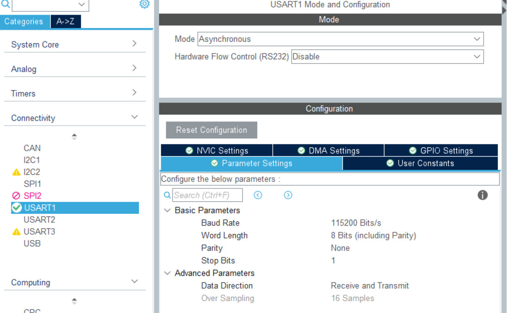
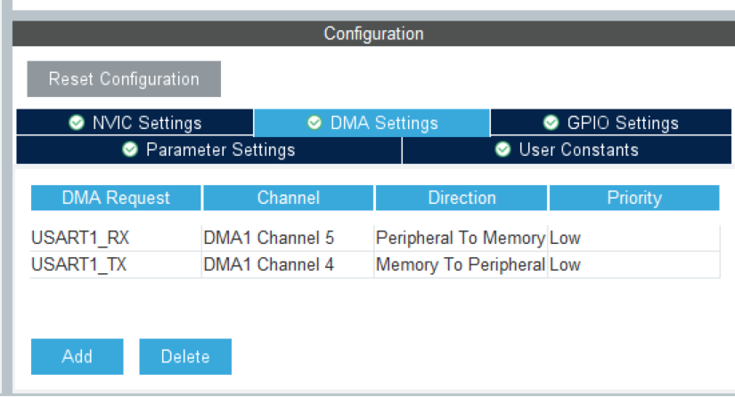

[toc]

# 模块名:Serial串口数据收发

## 1. 项目简介

* **功能**:**实现单片机及蓝牙之间的信息通信,并且通过约定协议保证一定的信息传输准确性**
* **传输**:采用数据包传输,传输方式有HEX(16进制)传输和文本(ABC)传输两种
* **传输协议**:
  * HEX传输:	
    * 协议:==帧头(0xFF) + 数据个数 + 数据 + 帧尾(0xFE)==
    * 帧头:0xFF
    * 数据个数:使用高低位传输方式,即高位+低位为1位有效数据,所以个数必为偶数,==并且由此单片机进行HEX传输都需要将有效数据转为高低位再传输==
    * 数据:高低位
    * 帧尾:0xFE
  * 文本传输:
    * 协议:==帧头('@') + 指令 + 1号帧尾('$') + 2号帧尾('#')==
    * 帧头:'@'
    * 指令:**建议采用"变量=数据"的形式**,可以使数据解析变得方便许多,同时不要有空格例:`"Kp=0.2"`
    * 1号帧尾:'$'
    * 2号帧尾:'#'

## 2. 核心功能

* 得到解析后的数据包
  * HEX:`int`数组,第0位为数据的个数(不含本位),后面就是解析好了的有效数据
  * 文本:`char *`字符串,即指令
* 判断数据包更新与否
  * 实现主函数调用数据包之前看看有没有更新,否则无法判断数据的新旧
* **得到传输信息错误原因**
  * 进行数据传输可能出现各种问题,可以通过查看error信息进行调试修改
  * `error_Serial_HEX`
    * 0 : 无错误
    * 1 : 错误1:帧头不合规
    * 2 : 错误2:数据长度有问题或者帧尾空缺
  * `error_Serial_ABC`
    * 0 : 无错误
    * 1 : 错误1:帧头不合规
    * 2 : 错误2:第1个帧尾不合规
    * 3 : 错误3:第2个帧尾不合规
* DMA发送数据
* 文本模式下可以实现串口发送指令改变相关变量的值
  * 这在调节PID等方面有很大的用处

## 3. 核心函数

1. 数据包直接在main调用即可

* HEX:`int`数组,第0位为数据的个数(不含本位),后面就是解析好了的有效数据
* 文本:`char *`字符串,即指令

```c
extern int  Serial_New_Package_HEX[]  ;			// HEX数据包 : 数据长度 + 数据
extern char Serial_New_Package_ABC[]	; 		// 文本数据包:	 纯文本
```

2. 判断数据更新与否

```c
// HEX: 判断是否更新数据
uint8_t Serial_GetNewPackageFlag_HEX(void) ;

// 文本:判断是否更新数据
uint8_t Serial_GetNewPackageFlag_ABC(void) ;
```

3. 得到传输信息错误原因

```c
// HEX: 得到错误原因
int Serial_GetError_HEX(void) ;

// 文本:得到错误原因
int Serial_GetError_ABC(void) ;
```

4. DMA发送数组数据

```c
// 数据通过DMA发送
void Serial_SendData_DMA(uint8_t *pData, uint16_t Size) ;
```

5. 文本模式下可以实现串口发送指令改变相关变量的值

```c
// 文本1:数据包指令改变浮点数据大小
bool Serial_SetFloatData( char *KeyWord , char *cmd , float *Data) ;
// 文本2:数据包指令改变整型数据大小
bool Serial_SetIntData( char *KeyWord , char *cmd , int *Data) ;
```


## 4. **基础必备代码**

### 4-1 库导入

```c
// 系统库
#include <stdlib.h>
#include "string.h"
#include <stdio.h>
#include <stdbool.h>
// 自设库
#include "OLED.h"
#include "Key.h"
// 本README关键库
#include "Serial.h"
```


### 4-2 全局变量(域)

```c
extern uint8_t RX_SerialArr[RX_Serial_LEN];	// DMA数据传输缓冲数组
extern int  Serial_New_Package_HEX[]  ;			// HEX数据包 : 数据长度 + 数据
extern char Serial_New_Package_ABC[]	; 		// 文本数据包:	 纯文本
```


### 4-3 setup

```c
// 开启DMA+接收空闲中断
HAL_UARTEx_ReceiveToIdle_DMA(&Serial_huart , RX_SerialArr , RX_Serial_LEN ) ;
```


### 4-4 while

```c
无
```


### 4-5 while后函数

```c
无
```


## 6. 功能示例代码

* HEX:

```c
// 放在while
if (Serial_GetNewPackageFlag_HEX() == 1)
{
    // OLED展示各个数据
    OLED_ShowNum(0 , 20 , Serial_New_Package_HEX[0] , 1 , OLED_8X16 ) ;
    for (int i = 1 ; i < Serial_New_Package_HEX[0] + 1 ; i ++)
    {
        OLED_ShowNum(20 , 10 + 10 * i , Serial_New_Package_HEX[i] , 5 , OLED_6X8 ) ;
    }
}
```

* 文本:

```c
// 放在while,记得提前声明test1(float)和check1(int)
if (Serial_GetNewPackageFlag_ABC() == 1)
{
    // 文本包调试程序
    Serial_SetFloatData("Kp" , "Kp=%f" , &test1) ;
    Serial_SetIntData("test" , "test=%d" , &check1) ;
    // OLED展示
    OLED_ShowFloatNum(20 , 50 , test1 , 1 , 6 , OLED_6X8) ;
    OLED_ShowNum(0 , 20 , check1 , 3 , OLED_8X16 ) ;
}
```


## 5. Cube配置

==**DMA配置:**==

* 基础配置



* NVIC配置


* DMA直接Add两个即可



## 7. 引脚定义

| 引脚号 |   标签    |
| :----: | :-------: |
|  PA9   | USART1_TX |
|  PA10  | USART1_RX |

## 8. 注意事项

### 8-1 代码迁移:

​	只需要在`Serial.h`中将

```c
#define Serial_huart huart1
#define Serial_USART USART1
```

​	改为`huartx` / `USARTx`即可(x自己另配置)

​	十分方便:smile:

### 8-2 关于数据包大小与数据溢出阈值

* 数据包大小:

```c
// DMA接收数组长度
#define RX_Serial_LEN 50
```

​	我都设置成50了,后面遇到了相应情景再进行缩减或者扩大

* 数据溢出阈值:
  * 首先跟数据包大小有关
  * 其次在**文本**模式下是有数据溢出阈值的,暂时硬编码设为20,看以后指令为多少就再改即可

### 8-3 **存在的问题**

* 由于HEX处理和文本处理是串行的,所以当遇到一个陌生的数据,帧头既不是HEX的也不是ABC的,那么两个error都会变为1,并且后续需要各自对应的数据才能消去为0,这里要注意一下,我觉得这只会在调试阶段遇到并且较好修正,在正式的数据传输时大概率不会有,以后再修吧......


## 9. 更新日志

* 2025/10/11:
  * 完成该工程
* 
