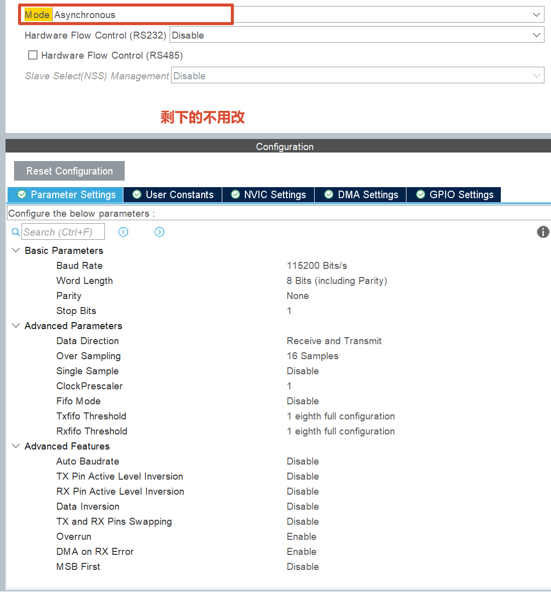
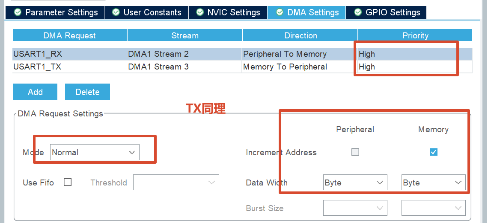
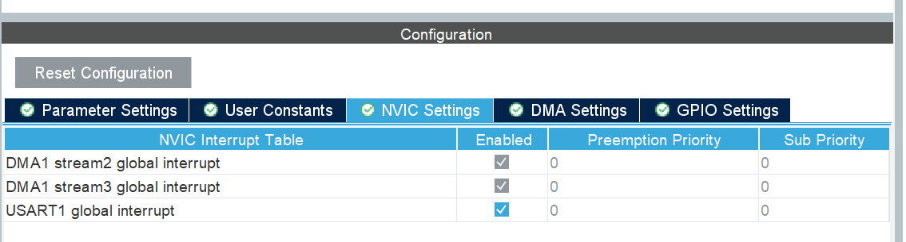

# 1. 基础信息

## 1-1 型号

需要看外壳上的型号而不是内部芯片，本电机是**Emm**类型

## 1-2 核心功能

|     配置参数     |      备注       |
| :--------------: | :-------------: |
|     目标速度     |                 |
|     目标角度     |                 |
|     旋转角度     |                 |
|     角度回零     | 直接目标为0即可 |
| 角度重设为零位置 |                 |
|     单圈归零     |     没必要      |
|                  |                 |
|                  |                 |

| 读取参数 | 备注 |
| :------: | :--: |
| 当前速度 |      |
| 当前角度 |      |
| 目标角度 |      |
| 其他配置 |      |
|          |      |
|          |      |
|          |      |

# 2. 串口驱动

## 2-1 串口DMA配置

### 2-1-1 Cube配置

+ 见附录

### 2-1-2 串口发送和接收基础代码

+ 一定记得H743需要==SCB_DisableDCache==

```c
// 初始化
HAL_UARTEx_ReceiveToIdle_DMA(&huart1, (uint8_t *)rxCmd, CMD_LEN);

// 串口发送
// 在这之前需要在Setup: SCB_DisableDCache();
HAL_UART_Transmit_DMA(&huart1, (uint8_t *)cmd, sizeof(cmd));

// 串口接收:在stm32h7xx_it.c里面进行书写
/**
  * @brief This function handles USART1 global interrupt.
  */
void USART1_IRQHandler(void)
{
  /* USER CODE BEGIN USART1_IRQn 0 */
    
    if(__HAL_UART_GET_FLAG(&huart1, UART_FLAG_IDLE) != RESET)
    {
        __HAL_UART_CLEAR_IDLEFLAG(&huart1); // 清除IDLE标志

        HAL_UART_DMAStop(&huart1); // 停止DMA，为了重新设置DMA发送多少数据

        rxFrameFlag = true; // 置位一帧命令接收完毕标志位

        // 重启DMA
        HAL_UARTEx_ReceiveToIdle_DMA(&huart1, (uint8_t *)rxCmd, CMD_LEN);
    }
    
  /* USER CODE END USART1_IRQn 0 */
  HAL_UART_IRQHandler(&huart1);
  /* USER CODE BEGIN USART1_IRQn 1 */

  /* USER CODE END USART1_IRQn 1 */
}
```


# 附录

## 1. Cube配置








