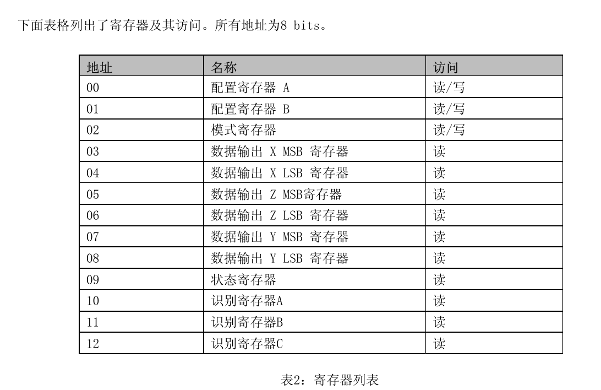

# HMC5883

## 1. Basic

* 供电电压 3.3V
* 启动时间 I2C控制准备时间  200  µs 

* IIC地址 
  * 7-bit 地址 0x1E
  * 8-bit 读取地址 ( 0x1E << 1 ) | 1 即 0x3D
  * 8-bit 写入地址 ( 0x1E << 1 ) | 0 即 0x3C

* 引脚说明

| 引脚 |                             说明                             |
| :--: | :----------------------------------------------------------: |
| VCC  |                          2.16-3.6V                           |
| GND  |                             地线                             |
| SCL  |                  串行时钟- I2C总线主/从时钟                  |
| SDA  |                  串行数据- I2C总线主/从数据                  |
| DRDY | 数据准备，中断引脚。内部被拉高。 选项为连接，当数据位于输出寄存器 上时会在低电位上停250μsec |

* 寄存器

