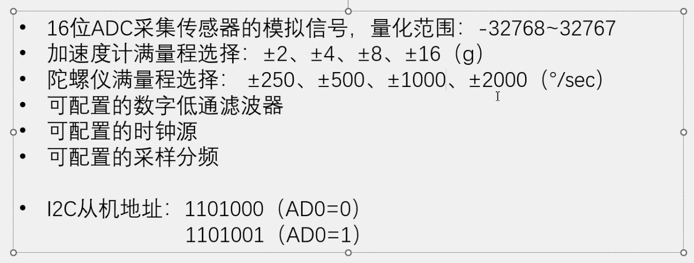
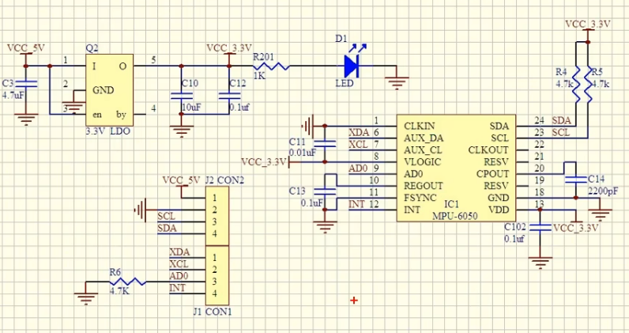
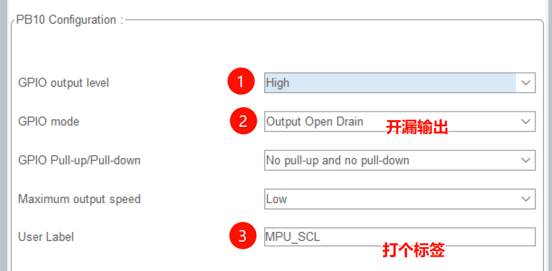

# MPU6050

## 1. 相关参数



* 满量程选择:也就是输出值为32767时的示数,满量程越大,测量的范围就越大,满量程越小,测量的精度就越高
* 如果抖动明显,可以加入低通滤波器
* 时钟源和分频则与采样速度和时钟有关
* 从机地址 AD0 = 0时,地址为1101000 -> 0x68 , 因为是7位发送,所以在IIC通信需要左移一位,也就是0xD0 , 所以在IIC通信时,可以直接把0xD0看作读取的地址,0xD1当做写的地址
  * 简单来说,0x68是7位原地址,但是IIC是8位为1个单位,所以需要左移变成0xD0,而读为0,写为1,所以D系列的写法是把移位融合,而D0则为读,D1则为写

## 2. 硬件电路



* 可以看出AD0为弱下拉,所以想要改写MPU6050的含移位地址的时候需要上拉到VCC
  * 也就是说MPU6050虽然只有一个0x68地址,但是通过写入AD0可以得到0x69,移位之后得到0xD2,也就是说可以使用AD0最多控制两个MPU6050,一个AD0不接,一个接3V3,得到两个移位地址
  * 地址1: 0xD0(读) 0xD1(写)
  * 地址2: 0xD2(读) 0xD3(写)

## 3.  软件IIC读写MPU6050

### 3-1 Cube配置



SDA同理

* 软件IIC的底层

* MPU6050读写函数
* 测试函数

```c
// 1. 得到ID号(地址)
//	uint8_t ID = MPU6050_ReadReg(0x75) ;
//	OLED_ShowHexNum(0 , 0 , ID , 3 , OLED_8X16 ) ;

// 2. 解除睡眠模式
//	MPU6050_WriteReg(0x6B, 0x00) ;
//	MPU6050_WriteReg(0x19, 0x75);
//	uint8_t ID = MPU6050_ReadReg(0x19);
//	OLED_ShowHexNum(0 , 0 , ID , 3 , OLED_8X16 ) ;
```

### 4. 算法

* 计算方法原理 : [六轴传感器+卡尔曼滤波+一阶低通滤波_mpu6050卡尔曼滤波-CSDN博客](https://blog.csdn.net/mayuxin1314/article/details/125117507)

* 三种滤波算法 : [嵌入式C语言使用低通滤波、高通滤波、互补滤波算法_低通滤波算法-CSDN博客](https://blog.csdn.net/mayuxin1314/article/details/135588501)

* 卡尔曼滤波配置 : [嵌入式C语言使用低通滤波、高通滤波、互补滤波算法_低通滤波算法-CSDN博客](https://blog.csdn.net/mayuxin1314/article/details/135588501)

* 

## 5. 磁力计

1. 原理

https://www.studocu.com/tw/document/%E6%98%8E%E5%BF%97%E7%A7%91%E6%8A%80%E5%A4%A7%E5%AD%B8/research-ethics/mpu6050%E7%A3%81%E5%8A%9B%E8%AE%A1%E6%B0%94%E5%8E%8B%E8%AE%A1%E4%BC%A0%E6%84%9F%E5%99%A8%E5%8E%9F%E7%90%86%E5%8F%8A%E5%A7%BF%E6%80%81%E8%A7%A3%E7%AE%97/121068526

2. 看一看参考代码

[MPU6050与磁力计融合：攻克Z轴角度漂移的血泪史_mpu6050z轴漂移-CSDN博客](https://blog.csdn.net/qq_45217381/article/details/149421958?ops_request_misc=elastic_search_misc&request_id=428783ad99322064112bde0ee8ec6a19&biz_id=0&utm_medium=distribute.pc_search_result.none-task-blog-2~all~sobaiduend~default-1-149421958-null-null.142^v102^pc_search_result_base3&utm_term=MPU6050 磁力计&spm=1018.2226.3001.4187)

 	3. 


