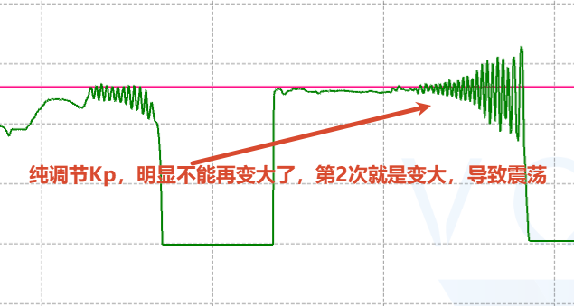
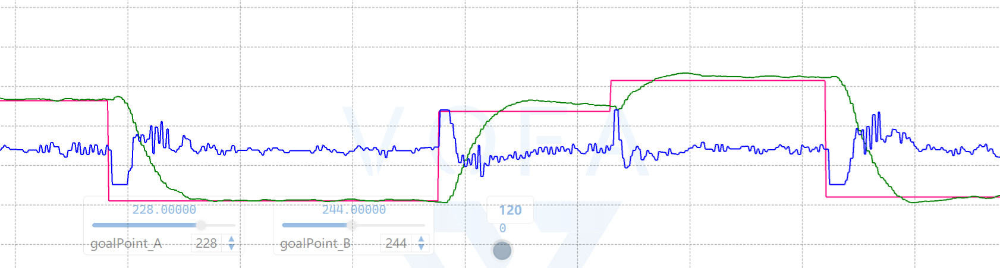
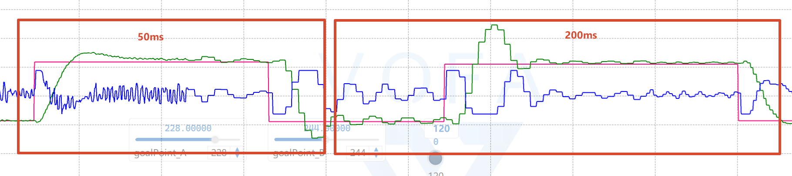
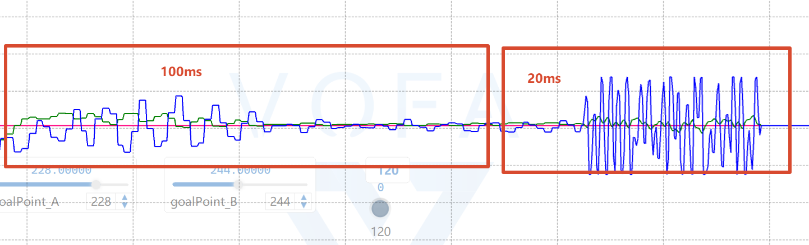
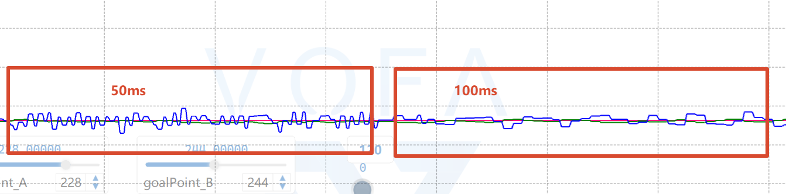

# 1. 判断中心是否正确

# 2. Kp范围界定

# 3. 加入Ki进行调定

# 4. PID调用周期对PID结果的影响

+ 首先找到合适的PID，调出差不多的值，记录周期(50ms，外环)
+ 然后更改周期

第1个：50ms，也就那样，稳定之后其实肉眼看上去很抖动

第2个：200ms，时间太久了，调节很慢，导致震荡

第3个：20ms，时间太短了，导致

+ 串级 PID 会退化成“两个控制器互相抢控制权”
+ 外环不断修改内环目标，但内环还没来得及完成上一次动作
+ 外环把内环的暂态过程误认为新的位置误差，继续追加控制量

**第4个：100ms，挺好的，调控仍然迅速，并且在静止的时候抖动更小**

