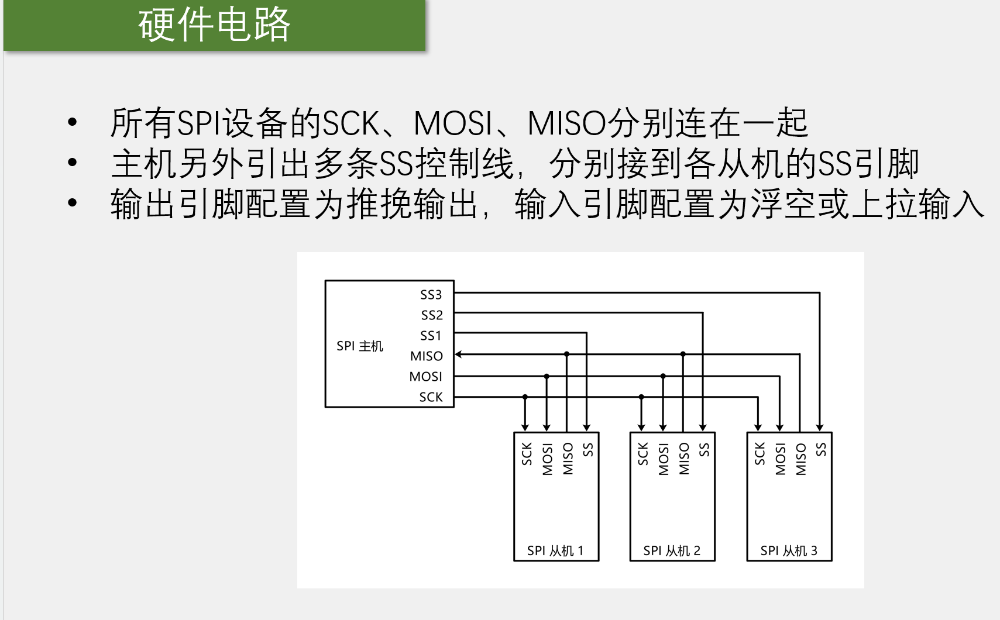
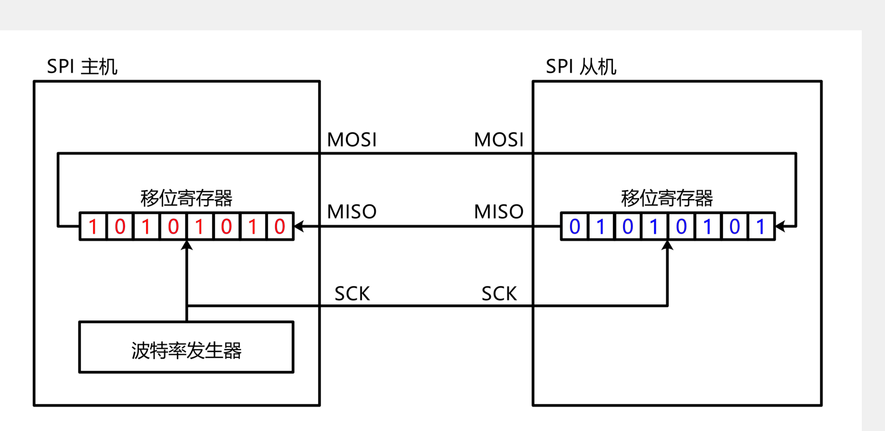
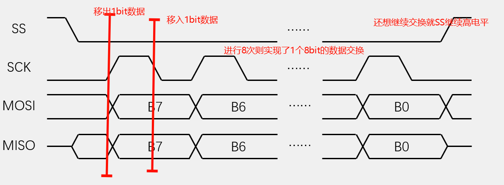
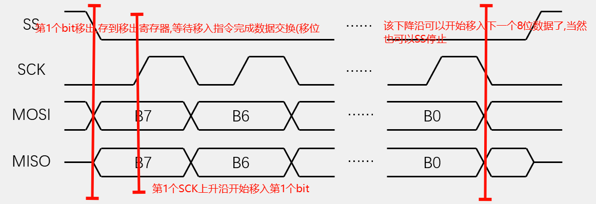
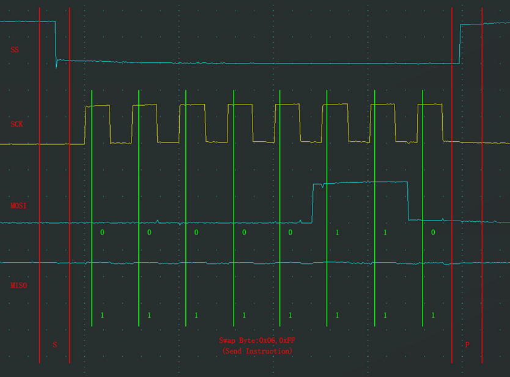
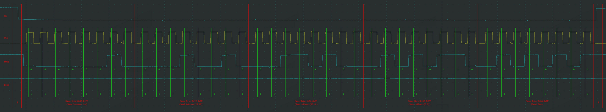
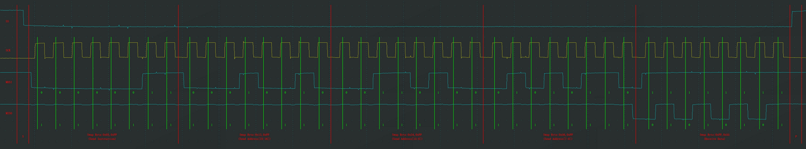

# 

[toc]

## 1. 通信线路

* MISO : Master Input Slave Output
* MOSI : Master Output Slave Input 

* SS : 位选,选择通信对象(一主多从)

* SCK : 时钟线

## 2. 数据传输原理 : 移位

## 3. ==时序基本单元==

### 3-1 起始与终止

* 起始条件: SS从H变成L
* 终止条件: SS从L变成H

### 3-2 字节交换

==CPOL : (Clock Polarity)== : 时钟极性 0 / 1

==CPHA :（Clock Phase）== : 时钟相位 0 / 1

* **所以有四种模式**,==重点了解模式0即可==

***

* 交换一个字节（==模式1==）

* CPOL=0：空闲状态时，SCK为低电平

* CPHA=1：==SCK第一个边沿(如上升沿)移出数据，第二个边沿(如下降沿)移入数据==

***

* 交换一个字节（==模式0==）

* CPOL=0：空闲状态时，SCK为低电平

* CPHA=0：SCK第一个边沿移入数据，第二个边沿移出数据

* 和模式1的区别:
  * 模式0在第一个边沿就需要移入数据,但是此时还没有数据移出,**所以在SS下降沿就进行一位移出**

***

* 交换一个字节（模式2）

* CPOL=1：空闲状态时，SCK为高电平

* CPHA=0：SCK第一个边沿移入数据，第二个边沿移出数据

***

* 交换一个字节（模式3）

* CPOL=1：空闲状态时，SCK为高电平

* CPHA=1：SCK第一个边沿移出数据，第二个边沿移入数据

### 3-3 具体电路沿(模式0)

#### 3-3-1 发送单个指令

•发送指令

•向SS指定的设备，发送指令（0x06）

* SCK上升沿对应写入数据(在SS下降沿的时候就开始输出(写出)数据了)

* SCK下降沿就开始写出数据

* 效果:主机写入0x06,从机交换到0xFF(垃圾数据,从机其实也不会鸟他)

#### 3-3-2 写入数据(指令 + 地址 + 数据)

•指定地址写

•向SS指定的设备，发送写指令（0x02），

 随后在指定地址（Address[23:0]）下，写入指定数据（Data）

* 时序效果 : 0x02发送写指令 + 地址(高低位一共24位)0x12(23:16) + 0x34(15:8) + 0x56(7:0) + 

8位数据:0x55 , 即 指令(8) + 地址(24) + 数据(**自己指定长度**(==SPI含有地址自增寻址,可以写入多位数据==))

#### 3-3-3 指定地址读(指令 + 地址 + 交换数据)

•指定地址读

•向SS指定的设备，发送读指令（0x03），

随后在指定地址（Address[23:0]）下，读取从机数据（Data）

* 时序效果:
  * 指令(0x03) : 读取数据指令
  * 地址(23:0) : 0x123456 : 地址
  * 数据(此时就是主机给垃圾值:0xFF等) , 从机交换来好东西:数据0x55
  * ==同样也有地址寻址自增,实现连续读==

## 4. FLash操作注意事项

写入操作时：

•==写入操作前，必须先进行写使能==

•每个数据位只能由1改写为0，不能由0改写为1(**导致下面的解决方案**)

•==写入数据前必须先擦除，擦除后，所有数据位变为1==

•擦除必须按最小擦除单元进行(一个扇区:4096个字节)

•连续写入多字节时，最多写入一页的数据，超过页尾位置的数据，会回到页首覆盖写入(因为RAM存不下了)

•==写入操作结束后，芯片进入忙状态，不响应新的读写操作==,所以需要进行忙状态判断,可以是写入数据之后while等待忙状态结束,也可以是读取等操作之前先判断是否是忙状态

读取操作时：

•直接调用读取时序，无需使能，无需额外操作，没有页的限制，读取操作结束后不会进入忙状态，**但不能在忙状态时读取**

