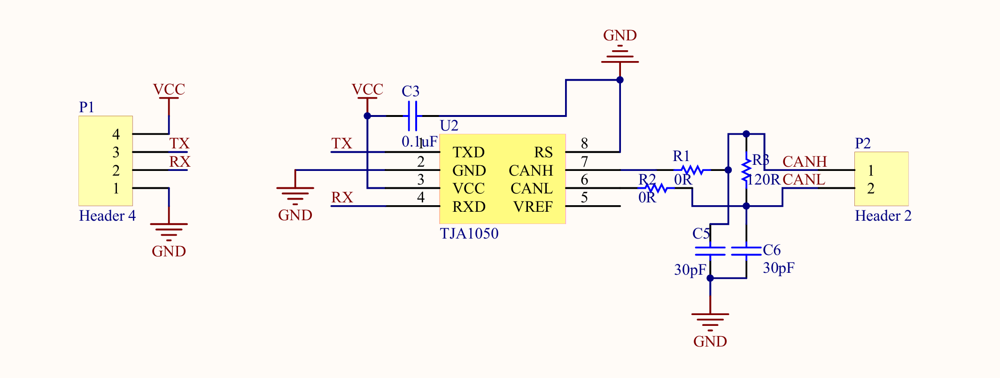
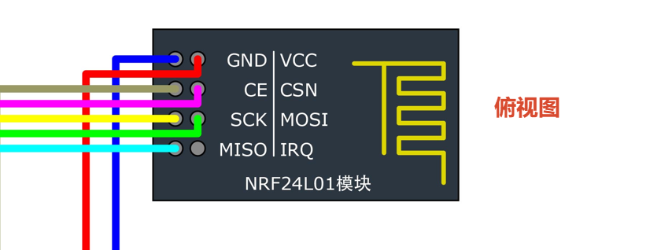

# 引脚计划

## 1. 常规引脚

|  引脚号  |  Label   |       备注       |
| :------: | :------: | :--------------: |
|   PC13   |   LED0   |     板载LED      |
|   PB12   |   KEY0   |      按键0       |
|   PB13   |   KEY1   |      按键1       |
| ==PA11== | OLED_SCL | 注意和往常不一样 |
| ==PA12== | OLED_SDA |                  |


# 2. 电机控制

+ 这里使用冗余方案，实现多冗余驱动
  + COM不需要接任何(NC)
  + 其实EN也可以不接
  + 记得做步进电机控制开关隔离处理

## 2-1 CAN总线控制

+ CAN 总线物理两端各使用一个 120Ω终端电阻，本板通过焊接跳线决定是否接入终端电阻。

| 引脚号 | Label  |      备注       |
| :----: | :----: | :-------------: |
|  PB9   | CAN_TX | 记得进行CAN转接 |
|  PB8   | CAN_RX |                 |

+ 注：这里的VCC是5V



| 图中位置 | 数量 | 器件                                                         | 商城编号 |
| -------- | ---- | ------------------------------------------------------------ | -------- |
| U2       | 1    | [NXP TJA1050T/CM,118，SOP-8](https://www.lcsc.com/product-detail/CAN-ICs_NXP-Semicon-TJA1050T-CM-118_C6952.html) | C6952    |
| C3       | 1    | [100nF、50V、X7R、0805](https://www.lcsc.com/product-detail/C277502.html) | C277502  |
| R1、R2   | 2    | [0Ω、0805](https://www.lcsc.com/product-detail/Chip-Resistor-Surface-Mount-UniOhm_Uniroyal-Elec-0805W8F0000T5E_C17477.html) | C17477   |
| R3       | 1    | [120Ω、±1%、0805](https://www.lcsc.com/de/product-detail/C17437.html) | C17437   |
| C5、C6   | 2    | [30pF、50V、C0G、0805](https://www.lcsc.com/product-detail/C5186744.html) | C5186744 |


## 2-2 串口总线控制

| 引脚号 | Label |   备注    |
| :----: | :---: | :-------: |
|  PB10  |  TX   | 使用串口3 |
|  PB11  |  RX   |           |


## 2-3 脉冲单独控制

+ ==这里可以配置焊接跳线，实现可控配置==
+ 注：当前懒得配置PWM，后面用到了这个驱动方式再说吧hhh

+ 例

```c
STM32 PA8 ── SJ ── STEP1
STM32 PB0 ── SJ ── DIR1
STM32 PA1 ── SJ ── EN1
```

+ 步进电机1

| 引脚号 |  Label   | 备注 |
| :----: | :------: | :--: |
|  PA8   | Stp1_Stp | TIM1 |
|  PB0   | Stp1_Dir |      |
|  PA1   | Stp1_En  |      |


+ 步进电机1

| 引脚号 |  Label   | 备注 |
| :----: | :------: | :--: |
|  PA0   | Stp2_Stp | TIM2 |
|  PB14  | Stp2_Dir |      |
|  PB15  | Stp2_En  |      |


# 3. 通信上位机

+ 这里使用ESP32作为上位机
  + 但是为了学习，所以也进行冗余，加入NRF24L01实现双上位机冗余

## 3-1 ESP32串口通信

| 引脚号 | Label | 备注  |
| :----: | :---: | :---: |
|  PA2   |  TX   | 串口2 |
|  PA3   |  RX   |       |

## 3-2 NRF24L01-SPI通信

+  NRF 一定：3.3V



| 引脚号 |   Label   | 备注 |
| :----: | :-------: | :--: |
|  PA5   | SPI1_SCK  | SPI  |
|  PA6   | SPI1_MISO | SPI  |
|  PA7   | SPI1_MOSI | SPI  |
|  PA4   |    CE     | GPIO |
|  PB5   |    CSN    | GPIO |


# 4. 串口通信

| 引脚号 | Label |              备注               |
| :----: | :---: | :-----------------------------: |
|  PA9   |  TX   |              串口1              |
|  PA10  |  RX   |       用作调参：USART0_PC       |
|        |       |                                 |
|  PA2   |  TX   |              串口2              |
|  PA3   |  RX   | 用作与ESP32通信：USART1_ESP32S3 |
|        |       |                                 |
|  PB10  |  TX   |            使用串口3            |
|  PB11  |  RX   |     用作ZDT通信：USART2_ZDT     |


# 5. I2C通信

| 引脚号 |  Label   |    备注     |
| :----: | :------: | :---------: |
|  PB6   | I2C1_SCL | 用作MPU6050 |
|  PB7   | I2C1_SDA |             |


# 6. 电池电压检测

| 引脚号 | Label |       备注       |
| :----: | :---: | :--------------: |
|  PB1   |  ADC  | 用作电池容量检测 |

+ 直接使用ADC即可

             + BAT+是12V锂电池
         
            BAT+
             │
             ┌─────────┼─────────┐
         │         │         │
         ↓         ↓         ↓
         降压模块    电机供电    电压检测
            │                    │
           5V                  分压电阻
            │                    │
         STM32等               PB1 ADC


```
           BAT+
            │
          120k
            │
            ├──────── PB1 / ADC1_IN9
            │               │
           33k            100nF
            │               │
GND ────────┴───────────────┘
```


# 7. ESP32引脚配置

| XIAO标号    | ESP32-S3 GPIO | 建议功能            | 原因               |
| ----------- | ------------- | ------------------- | ------------------ |
| **D0 / A0** | GPIO1         | **3按键 ADC**       | ADC脚，单脚解决3键 |
| D1 / A1     | GPIO2         | 扩展 ADC/GPIO       | 留空最实用         |
| D2 / A2     | GPIO3         | 扩展 ADC/GPIO       | 留空               |
| D3 / A3     | GPIO4         | 扩展 GPIO/PWM       | 留空               |
| **D4 / A4** | GPIO5         | **OLED SDA**        | 官方默认 SDA       |
| **D5 / A5** | GPIO6         | **OLED SCL**        | 官方默认 SCL       |
| **D6**      | GPIO43        | **UART TX → STM32** | 官方默认 TX        |
| **D7**      | GPIO44        | **UART RX ← STM32** | 官方默认 RX        |
| D8          | GPIO7         | SPI SCK             | 预留               |
| D9          | GPIO8         | SPI MISO            | 预留               |
| D10         | GPIO9         | SPI MOSI            | 预留               |
