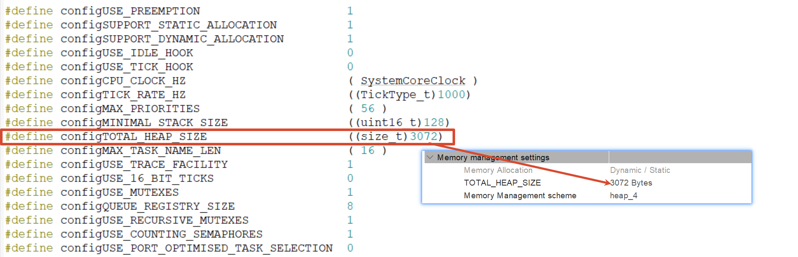

# 1. 任务栈的分配

+ 任务栈是以word（字->4B）来计的
  + 任务栈包含default任务和自建任务
  + `xTaskCreate`的`usStackDepth`是以字来计算的，所以 ==* 4就是这个任务占用的Byte数==
  + 比如`xTaskCreate(Key_Task, "Key_Task", 128U, NULL,20U, &keyTaskHandle`
    + **这里的单位是word，所以占用了128 *  4 = 512B的栈大小**
  + 注意：`osThreadId_t defaultTaskHandle;`采用的是Byte又不是word，所以还是建议使用FreeRtos原生API好啊

+ 那么假设有4个任务，每个都是128 word栈
  + 那么就是128 * 4 *4 = 512 * 4 = 2048，而STM32F1默认栈大小是3072B
    + 所以其实捉襟见肘

+ 

# 2. 任务优先级分配

+ 任务优先级**数字越大**，优先级**越高**。
