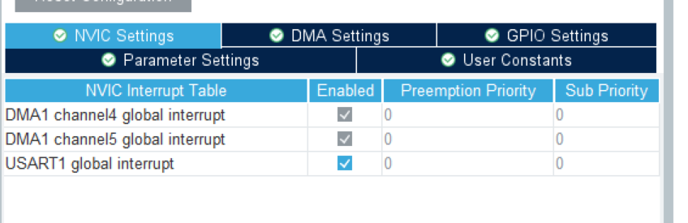

[toc]

## USART_DMA基础

### 1. Cube配置

* 基础配置


* NVIC配置



* DMA直接Add两个即可


### 2. 基础代码

* 全局变量

```c
// DMA串口接收变量
#define RX_USART1_LEN 50
uint8_t RX_USART1[RX_USART1_LEN] ;	// 接收数组
```

* setup初始化

```c
HAL_UARTEx_ReceiveToIdle_DMA(&huart1 , RX_USART1 , RX_USART1_LEN ) ;// 开启DMA+接收空闲中断,接收的数据都存储在RX_USART1
```

* DMA发送数据

```c
uint8_t sendbuff[] = "hello" ;
HAL_UART_Transmit_DMA(&huart1, (uint8_t *)sendbuff, sizeof(sendbuff));
```

* DMA接收中断

```c
// 串口空闲中断回调函数
void HAL_UARTEx_RxEventCallback(UART_HandleTypeDef *huart, uint16_t Size)
{
	if (huart->Instance == USART1)
	{
		// 加上\0防止越界
		if (Size < RX_USART1_LEN)
		{
			RX_USART1[Size] = '\0';
		}     
		
		// 清理缓冲区剩余数据，防止旧数据残留
    memset(RX_USART1 + Size, 0, RX_USART1_LEN - Size);
		
		// 发送回显
		HAL_UART_Transmit_DMA(&huart1, (uint8_t *)RX_USART1, sizeof(RX_USART1));
		
		// 每次处理完需要重新开启DMA中断
		HAL_UARTEx_ReceiveToIdle_DMA(&huart1 , RX_USART1 , RX_USART1_LEN ) ;
	}
}
```

